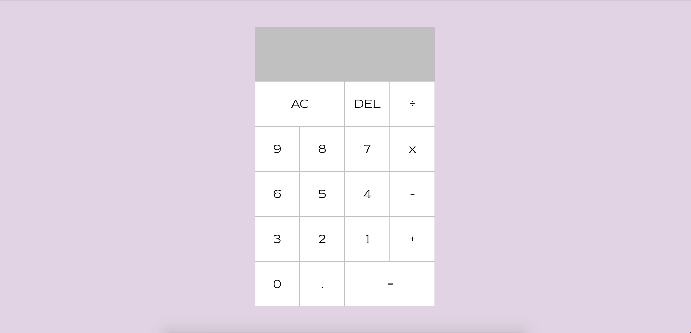

# Calculator
A simple calculator with two inputs and returns the result of the various functions. 

**View project in browser:** https://dfdev-calculator.netlify.app/

## Design and Development
**Skills Used** HTML, CSS, JavaScript:
I built this calculator by breaking down its components and pseudo-coding what each function would do (i.e., addition, subtraction, division, multiplication). Doing so made it easier to translate into functions in JavaScript.

## Lessons Learned
In the beginning I started writing in JS by what I knew and after laying down the bulk of the foundation, I was able to optimize to achieve cleaner code. 
